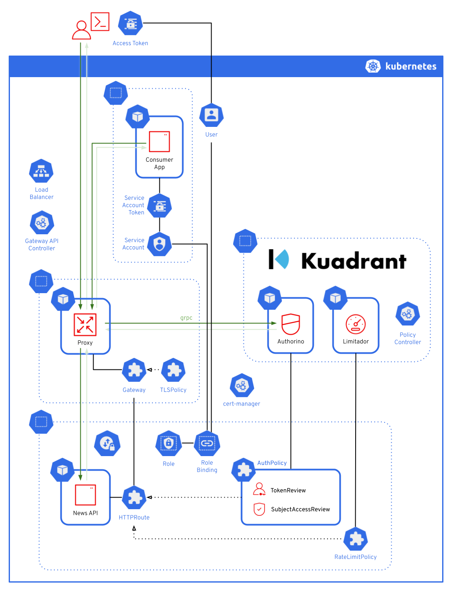

# Kubernetes Auth with Kuadrant

Demo tutorial of protecting a service application with Kubernetes Auth and Rate Limiting using [Kuadrant](https://kuadrant.io).

### Highlighted capabilities
- Kubernetes Auth ([TokenReview](https://kubernetes.io/docs/reference/kubernetes-api/authentication-resources/token-review-v1/) and [SubjectAccessReview](https://kubernetes.io/docs/reference/kubernetes-api/authorization-resources/subject-access-review-v1/)) • powered by Kuadrant [`AuthPolicy`](https://docs.kuadrant.io/0.10.0/kuadrant-operator/doc/auth/) and [Authorino](https://docs.kuadrant.io/0.10.0/authorino/)
- Rate Limiting • powered by Kuadrant [`RateLimitPolicy`](https://docs.kuadrant.io/0.10.0/kuadrant-operator/doc/rate-limiting/) and [Limitador](https://docs.kuadrant.io/0.10.0/limitador/)
- Auto TLS certificate management • powered by Kuadrant [`TLSPolicy`](https://docs.kuadrant.io/0.10.0/kuadrant-operator/doc/tls/) and [cert-manager](https://cert-manager.io/)

### Stack
- [Kubernetes](https://kubernetes.io)
- [Gateway API](https://gateway-api.sigs.k8s.io/)
- [Istio](https://istio.io)
- [Kuadrant](https://kuadrant.io)
- [cert-manager](https://cert-manager.io/)
- [MetalLB](https://metallb.org/)

### Topology and request flow

### Requirements

- [Docker](https://www.docker.com/) or [Podman](https://podman.io/)
- [kubectl](https://kubernetes.io/docs/reference/kubectl/introduction/)
- [Kind](https://kind.sigs.k8s.io/)
- [Helm](https://helm.sh/)
- [curl](https://curl.se)
- [yq](https://github.com/mikefarah/yq)
- [Docker Mac Net Connect](https://github.com/chipmk/docker-mac-net-connect) or [Podman Mac Net Connect](https://github.com/jasonmadigan/podman-mac-net-connect) (macOS only)

## Run the steps

#### ❶ [Deploy an application as usual](1-deploy.md)
#### ❷ [Setup a gateway](2-gateway.md)
#### ❸ [Enable security capabilities for the gateways](3-kuadrant.md)
#### ❹ [Add authentication and authorization to the application](4-auth.md)
#### ❺ [Add rate limiting to the application](5-rate-limit.md)

 

#### [Cleanup](cleanup.md)
